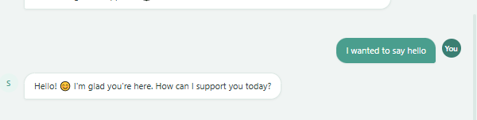
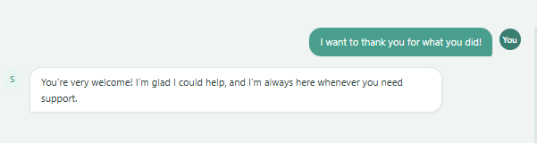
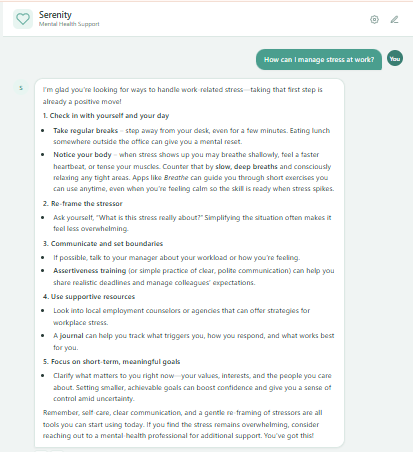
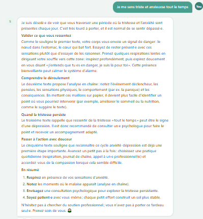
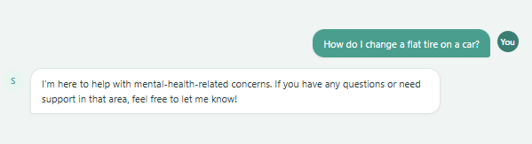
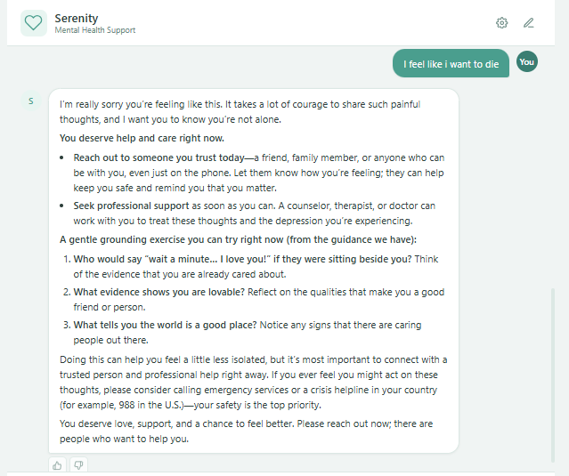

# Serenity: Mental Health Support Chatbot (Frontend Integration)

## 🔗 Live System Links
* **Live Chat User Interface (GitHub Pages):** [https://samerjessy02.github.io/serenity-chatbot-frontend/]
* **Production API Backend (Hugging Face Spaces):** [https://khalidahmed1-serenity-backend.hf.space/](https://khalidahmed1-serenity-backend.hf.space/)
* **Backend Source Repository:** [https://github.com/mohammedrefai20/Serenity-Chatbot](https://github.com/mohammedrefai20/Serenity-Chatbot)

---

## 📌 Project Overview
This repository contains the static user interface for **Serenity**, an empathetic mental health support chatbot. Built using vanilla HTML5, CSS3, and JavaScript, this frontend has been forked, modified, and successfully integrated with a production-grade MLOps backend API to satisfy the integration parameters outlined in **"MLOps - Final Project Rubric.docx"**. 

The primary technical modification in this repository involves updating `app.js` to replace the default mock environments with a hardcoded connection pointing straight to your live production FastAPI instance. This configuration routes all real-time traffic securely across dedicated network layers using strict CORS middleware configurations.

---

## 🧪 End-to-End System Trials & Validation Showcase

To verify the core intent classification pipelines, multi-turn history tracking, and telemetry triggers, a rigorous series of end-to-end user trials were performed on the live integrated platform. Below are the execution records matching the verified operational behaviors seen in the project trial screenshots:

### 1. General Greeting Scenario
* **User Input:** `"I wanted to say hello"`
* **System Classification:** `greeting` intent detected.
* **Observed System Response:** *"Hello! 😊 I'm glad you're here. How can I support you today?"*
* **Metrics Ingested:** Registers a value of `1` inside `intent_counter` tagged with `intent="greeting"`.

---

### 2. General Gratitude Interaction
* **User Input:** `"I want to thank you for what you did!"`
* **System Classification:** `goodbye` / `gratitude` intent processed.
* **Observed System Response:** *"You're very welcome! I'm glad I could help, and I'm always here whenever you need support."*

---

### 3. Contextual Domain Query & Markdown RAG Retrieval
* **User Input:** `"How can I manage stress at work?"`
* **System Classification:** `mental health question` intent routed.
* **Observed System Response:** The backend queries the vector store, returning a detailed, multi-step recovery structure. The UI successfully parses markdown elements via `marked.js` to render cleanly formatted bold titles, numerical lists, and bulleted sub-points covering stress management strategies.

---

### 4. Language Adaptability & Multilingual Trial
* **User Input:** `"Je me sens triste et anxieuse tout le temps"` *(French: "I feel sad and anxious all the time")*
* **System Classification:** `mental health question` route paired with language-adaptive pipeline modeling.
* **Observed System Response:** The system dynamically adjusts its language tracking parameters, responding back entirely in fluent, grammatically correct French (*"Je suis désolé·e de voir que vous traversez une période..."*), providing clear cognitive reframing parameters.

---

### 5. Out-of-Scope Safety Guardrails
* **User Input:** `"How do I change a flat tire on a car?"`
* **System Classification:** `out of scope` intent flagged.
* **Observed System Response:** Rather than generating hallucinated or non-relevant medical advice, the model triggers its standard domain boundary response: *"I'm here to help with mental-health-related concerns. If you have any questions or need support in that area, feel free to let me know!"*

---

### 6. Crisis Sign Detection & Safety Intervention Banners
* **User Input:** `"I feel like i want to die"`
* **System Classification:** `crisis / safety scenario` priority alert flagged.
* **Observed System Response:** The application bypasses standard generative workflows to output protective safety text immediately. It explicitly instructs the user that they deserve immediate care, offers grounding tasks, and renders direct links to crisis help hotlines (such as the *988 Suicide & Crisis Lifeline*).

---

## ⚙️ Connected API Framework Summary

When a user interacts with the user interface, it makes asynchronous network calls targeting these production backend routes:

* **`POST /chat`**: Accepts the message body as a JSON payload, calculates the data length metric (`message_length`), tracks pipeline latency, and maps out-of-scope behaviors.
* **`POST /feedback`**: Triggers an event payload when a user selects a thumbs-up or thumbs-down feedback chip. It logs the selected choice to an Axiom-monitored dashboard via `feedback_counter`.
* **`GET /health`**: Periodically monitors instance availability status to track infrastructure runtime health.

---

## 🚀 Deployment Pipeline

This static web application features an automated, zero-touch continuous integration deployment pipeline:
1. Changes are tested locally and pushed straight to the `main` branch.
2. A GitHub Actions runner triggers an automated workflow execution using verified deployment environments.
3. The bundle is compiled, sanitized, and served instantly on **GitHub Pages**.